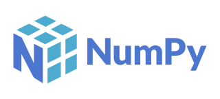
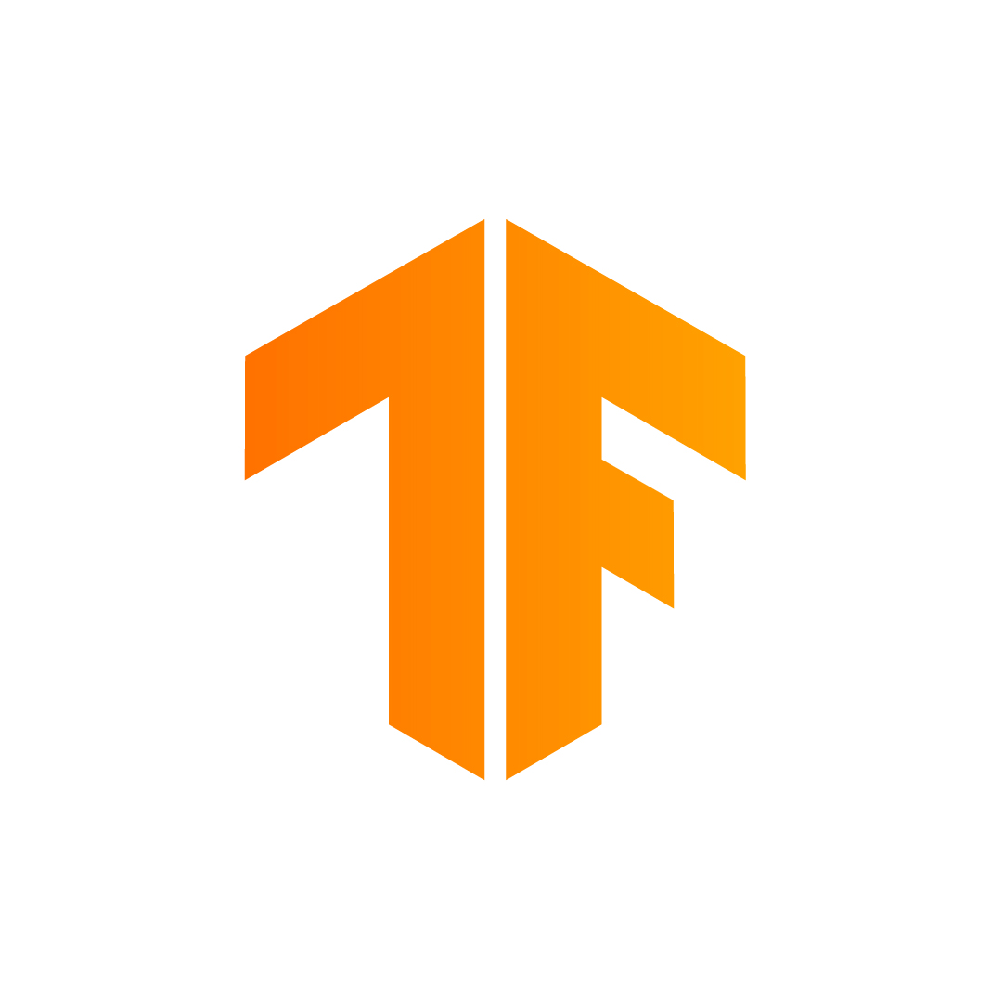
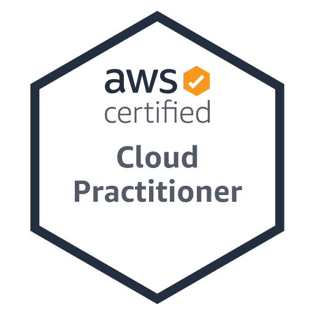
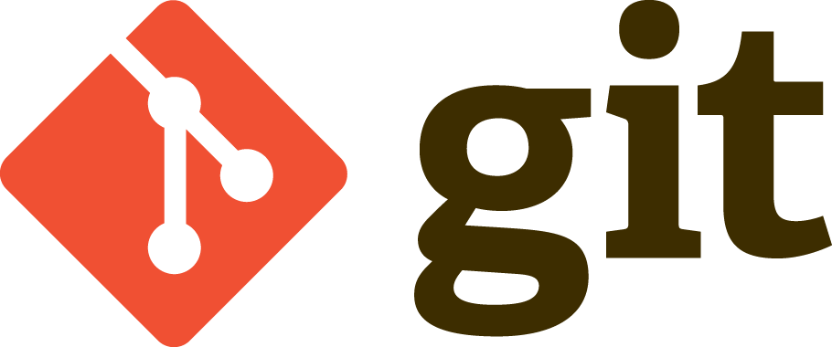
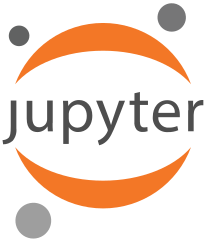

# Hi 👋, I am Jayrus Kiprotich!

### Welcome to my GitHub profile 🙏🏼

---
## About Me:
<!-- 

  

 -->

### Full-Stack Developer | Cloud & DevOps Enthusiast | Scalable Systems | API Development | Automation 

*Software Engineer with strong expertise in designing, developing, and maintaining scalable software solutions across diverse environments. Skilled in full-stack development, cloud computing, and DevOps practices, with a focus on building reliable, secure, and high-performance applications. Experienced in developing RESTful APIs, optimizing system performance, and implementing CI/CD pipelines to streamline software delivery. Proficient in modern development frameworks and cloud platforms, with a passion for writing clean, maintainable code and solving complex engineering challenges. I actively collaborate with cross-functional teams, mentor aspiring developers, and contribute to building innovative solutions that drive business value and technological advancement.*

---
### Profile Summary

As a Software Engineer with extensive experience in modern development practices, I am passionate about leveraging technology to build efficient, scalable, and reliable software solutions. I have a strong background in software design, system architecture, and application development, and I am skilled in developing end-to-end solutions that deliver value to users and stakeholders. I focus on writing clean, maintainable code and continuously improving system performance to support business growth.
  
I have worked on a diverse range of projects, including backend systems, API development, automation tools, and scalable cloud-based applications. I am comfortable handling large datasets and building efficient systems capable of processing complex data workflows. My experience includes designing and developing robust solutions that ensure high performance, reliability, and seamless integration across different platforms.
  
As a collaborative and team-oriented Software Engineer, I am committed to delivering high-quality solutions that meet the needs of clients and stakeholders. I value effective communication and teamwork, and I consistently focus on achieving results that align with project goals. I am also passionate about continuous learning and staying updated with emerging technologies in software development, cloud computing, and modern engineering practices.
<b><b>
I am dedicated to building impactful software solutions, with a strong focus on software engineering, system design, and scalable application development. My portfolio, featuring my work and contributions, can be viewed on GitHub *(here, under [repositories](https://github.com/Bernado6tab=repositories))*. I am appreciative of chances to advance professionally, demonstrate my knowledge, and demonstrate my dedication to leaving a lasting impression. If you share my vision and wish to collaborate, feel free to reach out at 📫 jayruskirui@gmail.com

#### Professional Links:

---
## Domains of Interests & Expertise
:comet: Statistics  
:comet: API Design & Development (REST & Microservices) 
:comet: Cloud Computing & Cloud-Native Applications 
:comet: DevOps & CI/CD Automation 
:comet: System Design & Software Architecture 
:comet: Database Systems & Data Modeling 
:comet: Distributed Systems 
:comet: Performance Optimization & Scalability 
:comet: Software Testing & Quality Assurance 
:comet: Application Security Best Practices 

---
## Skills 

### Languages, Libraries, Tools and Frameworks: 
 

    
    
    
    
    
    
    
    
    
    
    
    
    
    
    
    
    
    
    <!-- 
     -->
    
    
    
    
    <!--  -->
   

---
### 💻 Programming

---
### 💾 Database Management

---
### 📷 Image Processing

---
### 📊 Data Visualization

---
### 🤖 ML/DL Frameworks

 

---
<!-- ### 🗣️ NLP

 -->
---
### 🤖 AI/ML Applications

 
 
 
 
 

---
### 📊 Data Science and ML

---
### :cloud: AWS

---
### 📜 Miscellaneous

---
<!-- 
  -->
<!--  -->
  
Thank you for taking the time to visit my GitHub profile! 🙏🏼

---

<!-- 
**Bernado6/Bernado6** is a ✨ _special_ ✨ repository because its `README.md` (this file) appears on your GitHub profile.

Here are some ideas to get you started:

- 🔭 I’m currently working on ...
- 🌱 I’m currently learning ...
- 👯 I’m looking to collaborate on ...
- 🤔 I’m looking for help with ...
- 💬 Ask me about ...
- 📫 How to reach me: ...
- 😄 Pronouns: ...
- ⚡ Fun fact: ... -->
